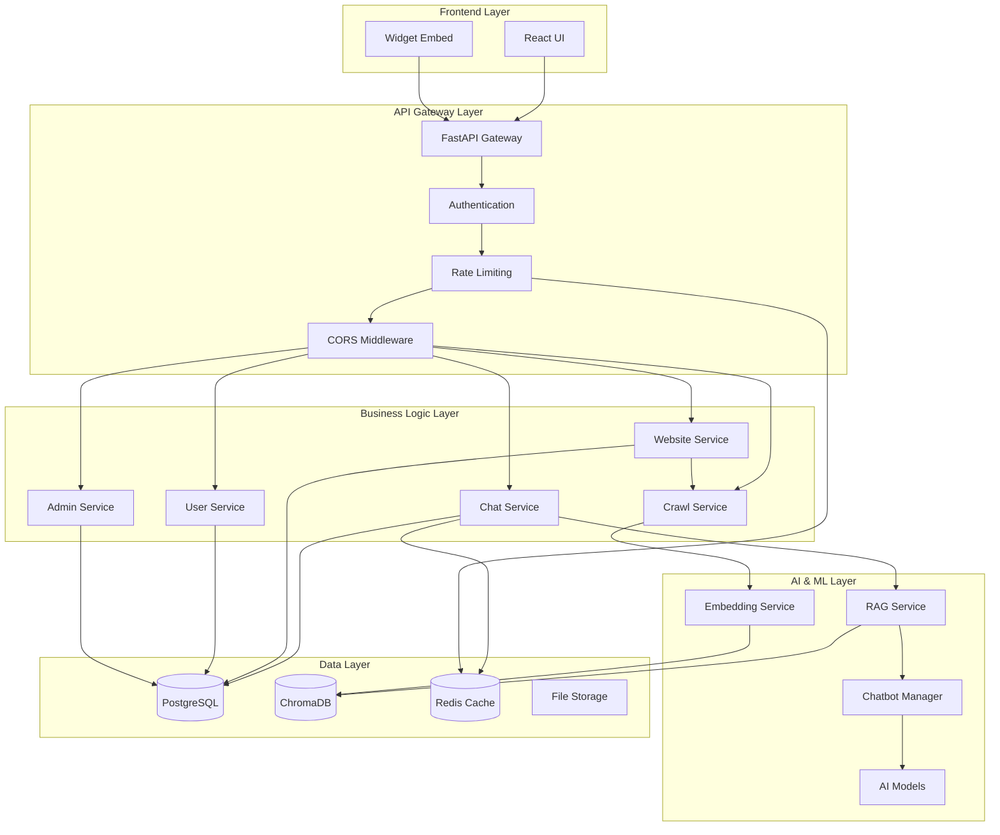
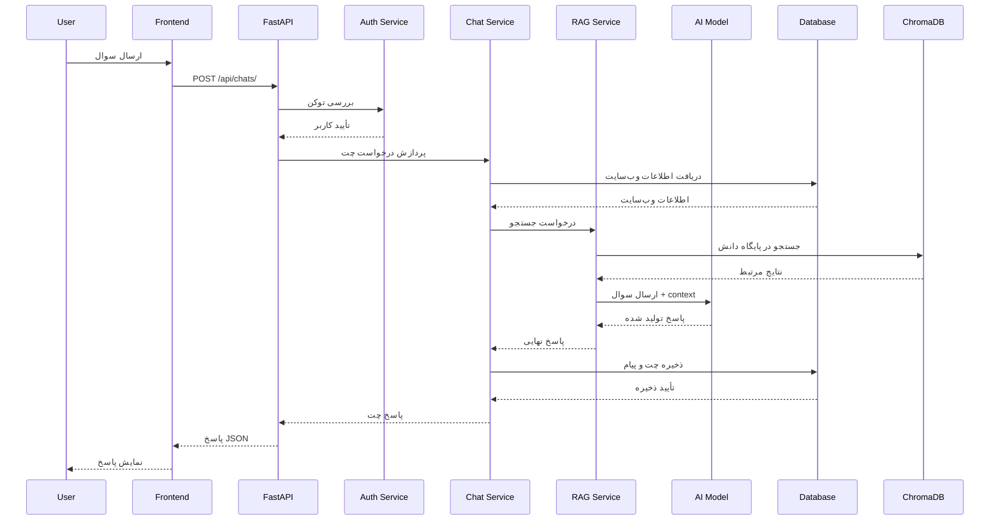
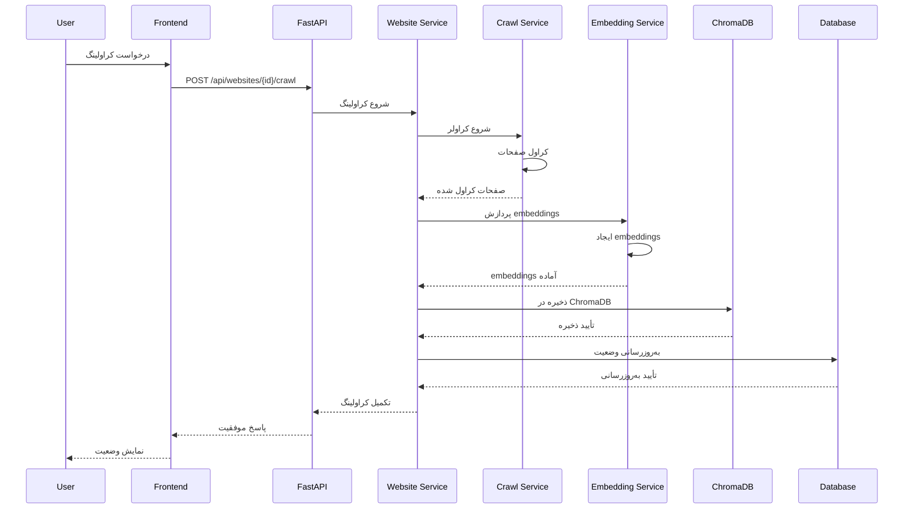
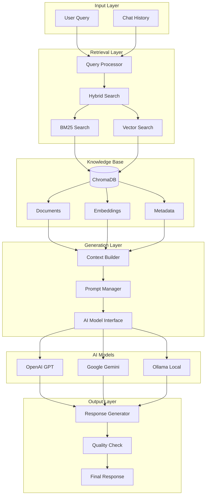
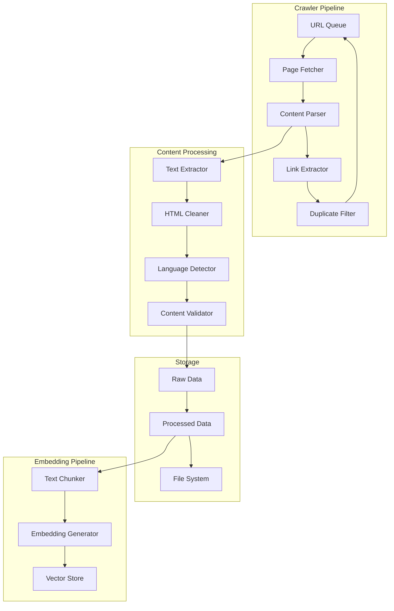
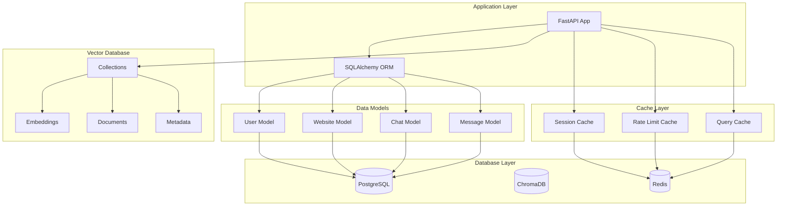
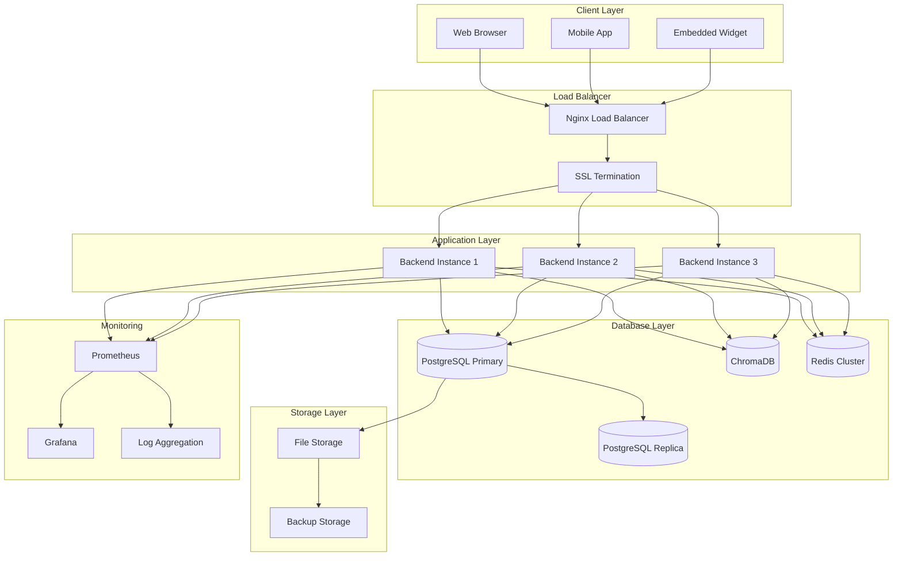
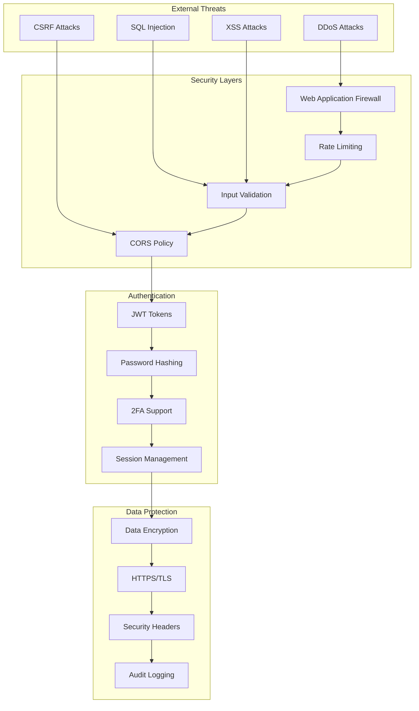
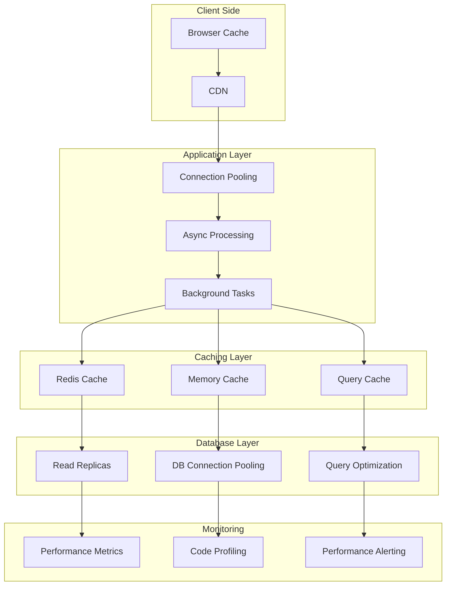

# نمودارهای معماری - سیستم چت‌بات هوشمند

## فهرست مطالب
- [معماری کلی سیستم](#معماری-کلی-سیستم)
- [جریان داده](#جریان-داده)
- [معماری احراز هویت](#معماری-احراز-هویت)
- [معماری چت و RAG](#معماری-چت-و-rag)
- [معماری کراولینگ](#معماری-کراولینگ)
- [معماری دیتابیس](#معماری-دیتابیس)

## معماری کلی سیستم

### نمودار لایه‌ای سیستم



## جریان داده

### نمودار جریان درخواست چت



### نمودار جریان کراولینگ وب‌سایت



## معماری احراز هویت

### نمودار جریان احراز هویت

```mermaid
graph LR
    subgraph "Client"
        Login[Login Form]
        Token[Token Storage]
    end
    
    subgraph "API Gateway"
        AuthEndpoint[/auth/login]
        JWTValidation[JWT Validation]
    end
    
    subgraph "Auth Service"
        PasswordCheck[Password Check]
        JWTGenerator[JWT Generator]
        UserDB[User Database]
    end
    
    subgraph "Security"
        RateLimit[Rate Limiting]
        CORS[CORS Policy]
        Headers[Security Headers]
    end
    
    Login --> AuthEndpoint
    AuthEndpoint --> PasswordCheck
    PasswordCheck --> UserDB
    UserDB --> JWTGenerator
    JWTGenerator --> Token
    
    Token --> JWTValidation
    JWTValidation --> RateLimit
    RateLimit --> CORS
    CORS --> Headers
```

## معماری چت و RAG

### نمودار معماری RAG



## معماری کراولینگ

### نمودار معماری کراولر



## معماری دیتابیس

### نمودار ERD (Entity Relationship Diagram)

```mermaid
erDiagram
    USERS {
        int id PK
        string email UK
        string full_name
        string hashed_password
        string role
        boolean is_active
        datetime created_at
        datetime last_login
        int login_attempts
        datetime locked_until
    }
    
    WEBSITES {
        int id PK
        string url UK
        string name
        string description
        string status
        int owner_id FK
        string collection_name
        json crawl_info
        datetime created_at
        datetime updated_at
    }
    
    CHATS {
        int id PK
        int website_id FK
        string session_id
        datetime created_at
        datetime updated_at
    }
    
    MESSAGES {
        int id PK
        int chat_id FK
        string role
        text content
        datetime created_at
        json metadata
    }
    
    USER_SETTINGS {
        int id PK
        int user_id FK
        json preferences
        string timezone
        boolean email_notifications
        datetime created_at
        datetime updated_at
    }
    
    SYSTEM_SETTINGS {
        int id PK
        string key UK
        string value
        string value_type
        string description
        datetime created_at
        datetime updated_at
    }
    
    USERS ||--o{ WEBSITES : owns
    USERS ||--o{ USER_SETTINGS : has
    WEBSITES ||--o{ CHATS : contains
    CHATS ||--o{ MESSAGES : has
    SYSTEM_SETTINGS ||--o{ } : configures
```

### نمودار معماری دیتابیس



## نمودار Deployment

### نمودار معماری Deployment



## نمودار Security

### نمودار معماری امنیت



## نمودار Performance

### نمودار معماری Performance



## نکات مهم نمودارها

### 1. **معماری کلی**
- سیستم از معماری لایه‌ای استفاده می‌کند
- هر لایه مسئولیت مشخصی دارد
- ارتباط بین لایه‌ها از طریق API انجام می‌شود

### 2. **جریان داده**
- تمام درخواست‌ها از طریق API Gateway عبور می‌کنند
- احراز هویت در لایه API انجام می‌شود
- داده‌ها در لایه‌های مختلف پردازش می‌شوند

### 3. **امنیت**
- چندین لایه امنیتی پیاده‌سازی شده
- Rate limiting و CORS محافظت می‌کنند
- JWT برای احراز هویت استفاده می‌شود

### 4. **Performance**
- Caching در چندین لایه پیاده‌سازی شده
- Connection pooling برای دیتابیس
- Async processing برای عملیات سنگین

### 5. **Monitoring**
- سیستم‌های monitoring در تمام لایه‌ها
- Logging و metrics برای debugging
- Alerting برای مشکلات عملکرد
